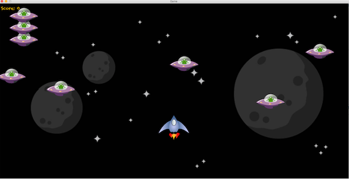

# Slick 2D Space Shooter Demo

## Project Description
This is a simple tech demo of a space shooter like game, written in Java, using the [Slick 2D library]([http://slick.ninjacave.com). The project is loosely based on [this tutorial](https://www.youtube.com/playlist?list=PLwuxcdQD6eMlpg0yeopJFGNvAIzufueBt). Its aim is a simple demo on how to use the Slick 2D library in
order to write a 2D game in Java.

## License
This project is licensed under the zlib license. See also the attached LICENSE file.

## How to play
You find a build of the latest release for your OS (Windows, Linux or MaxOSX) within directory `build`. 
You control the spaceship with `W-A-S-D` and shoot by clicking the left mouse button.

## How to build
Since LWJGL requires OS dependent native libraries, you cannot just export an executable -jar in order to to run the game on your system outside your IDE.
You need to create a so called 'fat .jar' which combines .jar files and OS dependent native files in one single .jar file. The tool [JarSplice](http://ninjacave.com/jarsplice) assits you in order to create such a fat jar. 

Follow those instructions to create a single .jar which runs under your OS:
1. Create a simple .jar (not executable .jar) from your game project. In my project, I put this .jar at `build/NotRunnable_SpaceShooter.jar` .
2. Download and open JarSplice.
3. In section <b>1) ADD JAR</b> of JarSplice, select the following files:
..* `build/NotRunnable_SpaceShooter.jar`
..* `lib/lwjgl.jar`
..* `lib/slick.jar`
3. In section <b>2) Add NATIVES</b> of JarSplice, you need to select all native files corresponding to your OS type. You can find natives for Windows, Linux and MacOSX in directory `lib/native`.
..* for Windows select all files at `lib/native/windows`
..* for Linux select all files at `lib/native/linux`
..* for MacOSX select all files at `lib/native/macosx`
4. In section <b>3) MAIN CLASS</b> of JarSplice, select the main class of your game.
..* Since this game does only uses the default package, you only need to enter `Main` (without .java).
5. Create the fat .jar through section <b>4) CREATE FAT JAR</b>, which will run independently on your OS. 

## Toolkit
* [JDK v.1.8.0_65](http://www.oracle.com/technetwork/java/javase/downloads/jdk8-downloads-2133151.html) - Java Development Kit. What else can I say?

* [Eclipse Java EE IDE for Web Developers v.4.5.0 (Mars)](https://www.eclipse.org) - Maybe the most famous IDE for Java developers.

* [Slick 2D Build #237](http://slick.ninjacave.com) - The game library which wraps around the LWJGL to make 2D programming in Java easier.

* [LWJGL v.2.9.3](https://www.lwjgl.org) - The famous library for game development under Java. Slick 2D wraps around the LWJGL to enable an more intuitive approach to program 2D games using LWJGL.

* [JarSplice v.0.40](http://ninjacave.com/jarsplice) - Application to create fat .jar files, which combine independent .jar files and OS dependent native libraries in order to create a runnable .jar file under the corresponding OS.

